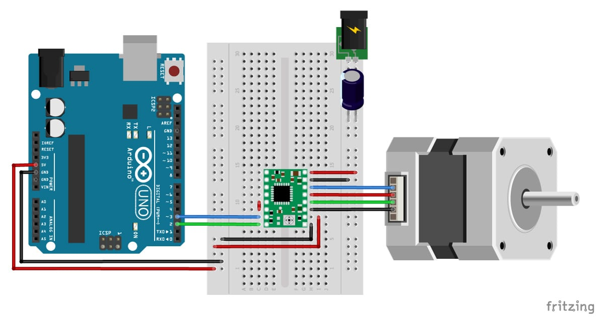

# MiniTorno para Ceramistas



O Mini Torno para Ceramistas é uma ferramenta essencial para aqueles que trabalham com cerâmica, oferecendo precisão e controle durante o processo de modelagem. Utilizando a plataforma NodeMCU e componentes adicionais, este projeto proporciona funcionalidades que incluem:

- Controle do motor de passo para girar a plataforma de modelagem.
- Potenciometro para controle de velocidade
- Utilização do drive A4988 para gerenciar o motor de passo de forma eficiente e silenciosa.

## Códigos úteis

Esse projeto está configurado para usar a cli do platformIO.

### Criando os arquivos de configuração para o vscode:

```shell
platformio init --ide vscode
```

### Instalação das Libs de dependências

```shell
pio run
```

### Upload para o arduino

```shell
pio run --target upload
```

### Monitor

```shell
pio device monitor
```

## Licença

Este projeto é distribuído sob a licença [MIT](LICENSE), o que significa que você é livre para utilizar, modificar e distribuir o código conforme necessário, desde que inclua a mesma licença nos seus projetos derivados.
